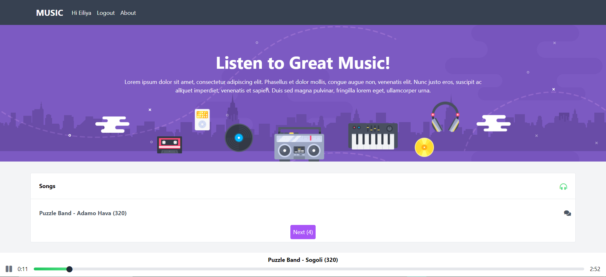
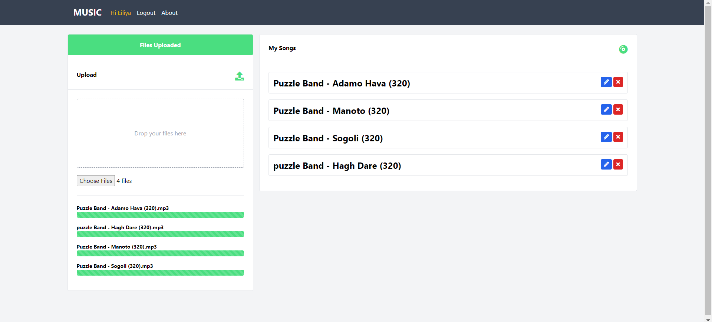
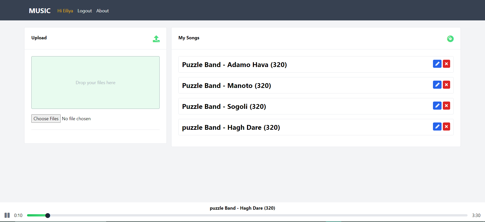
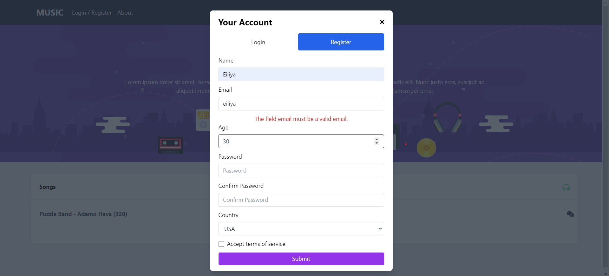
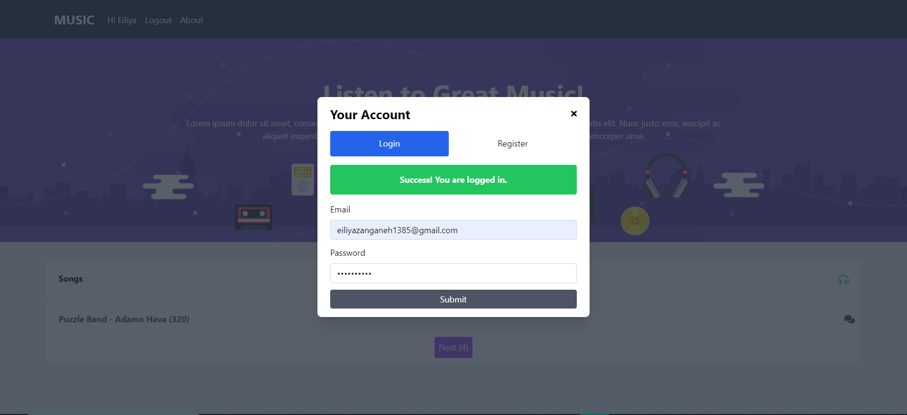
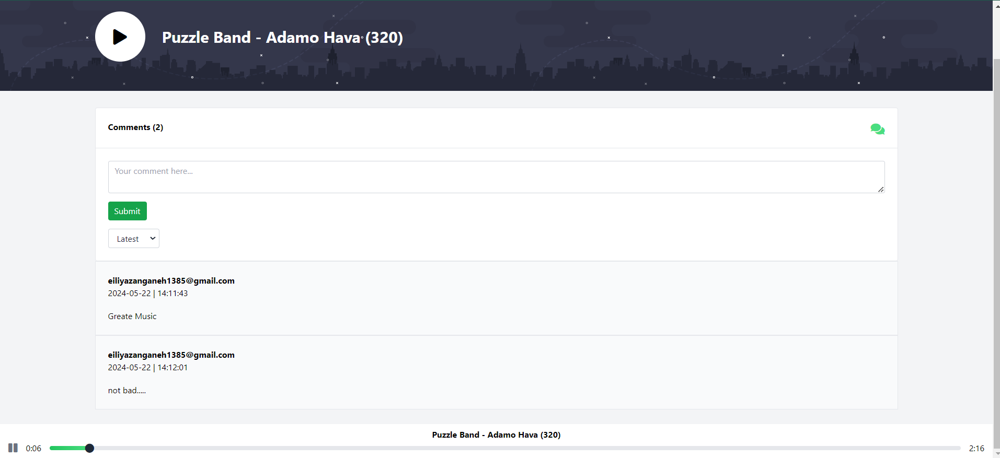
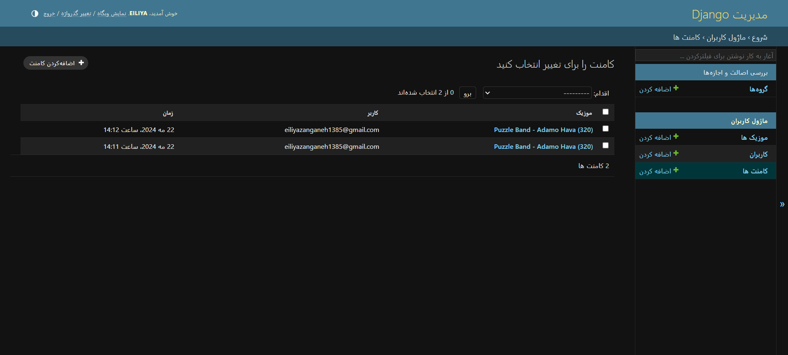

# Music Project
#### With Django & VueJs 

---

A music project for publishing audio files, music and podcasts.

Some features of the project:
-    Authentication system with JWT.
-    Upload music simultaneously.
-    Change music information.
-    Change music information.
-    Play music on all pages of the site.
-    The ability to keep and play music.
-    Ability to change time in music.
-    Implementation of pagination.
-    Ability to comment on music.
-    , ......

Project images:

#### Home Page:

#### Upload Files:

#### Manage Page:

#### Register Section:

#### Login Section:

#### Detail Music & Comments:

#### Admin Page:

## For more details, visit the server and client section
